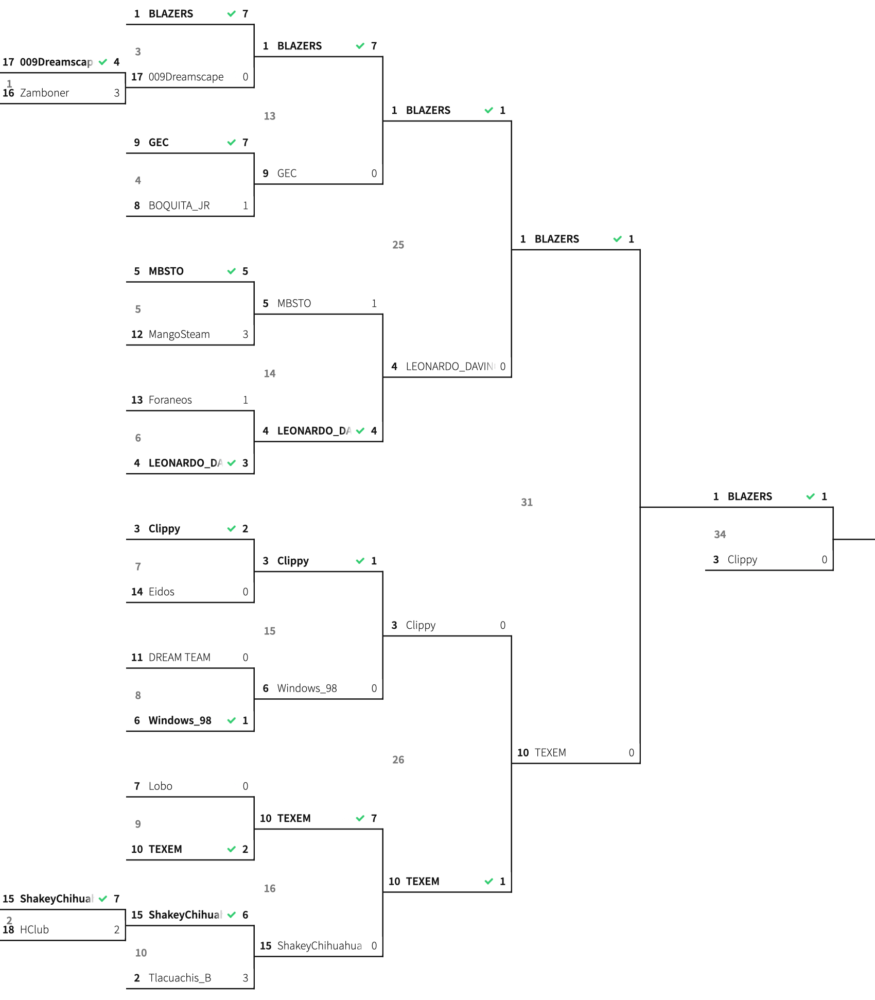
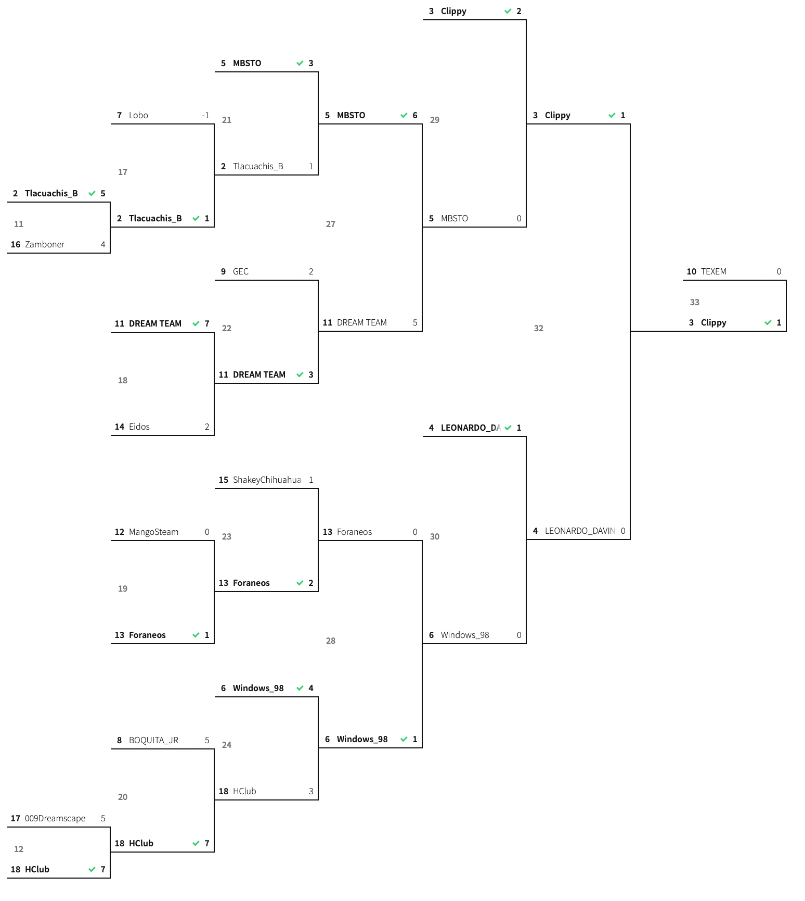
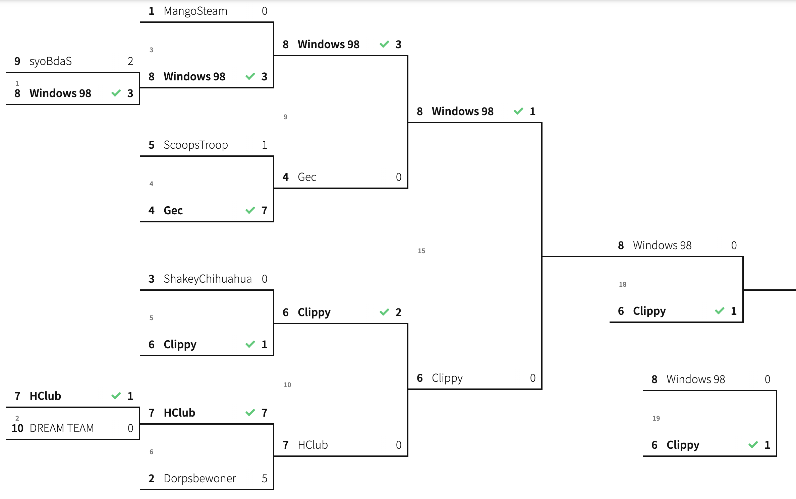
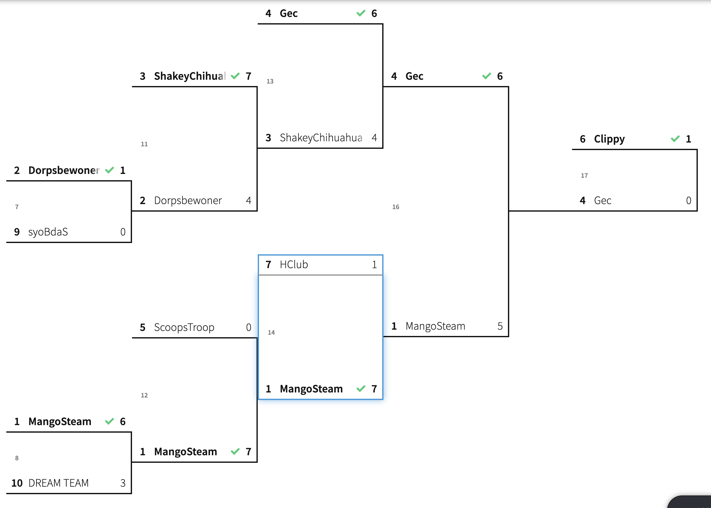
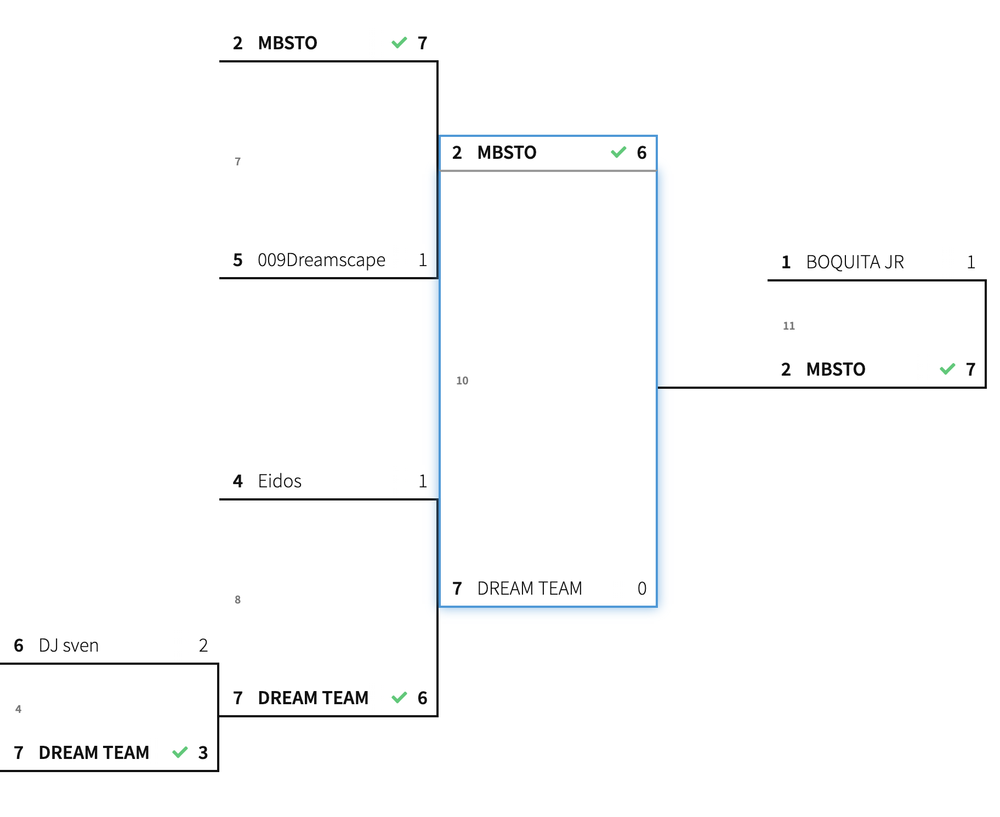
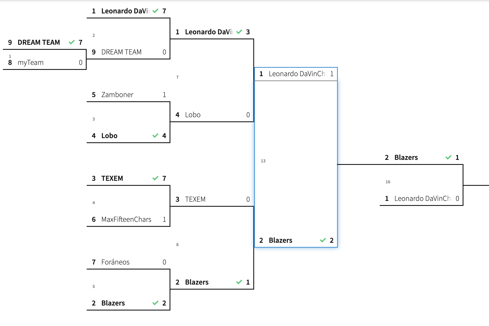
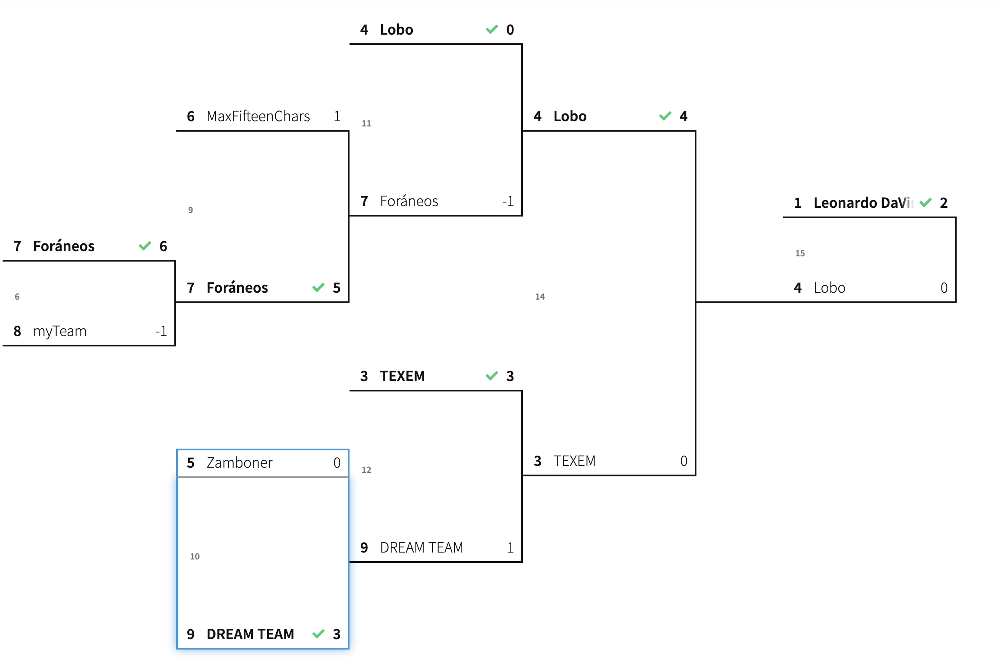

# CHALLENGE for Week i: AI-AirHockey Competition

__Tecnologico de Monterrey, campus Santa Fe__

__Organizer:__ Dr. Leonardo Chang

## Challenge Objective

Create an algorithm that allows to determine the movements of the air hockey paddle looking to score goal in the opposite side.

_All kinds of algorithms can be used, from algorithms that implement programmers' own strategies, algorithms adapted from other problems or machine learning algorithms._

Teams of up to 3 students.

**For all the details, see  ~/docs/20191028_AI-AirHockey-Semanai_.pdf**

# TOURNAMENT RESULTS (WINNERS)!!!

Congratulations to all the winners of the challenge!!

| Competition | Team |
|:------      | :----- |
| Absolute Winner | Blazers | 
| Category 123 | Clippy | 
| Category 456 | Tlacuachis B | 
| Category 789 | Blazers | 

_You can find all the competing solutions in ~/players/_

**DON'T MISS IT:** _Watch all the final competition games in ~/videos/_

-------------------
## Absolute winner competition

-------------------
## Category 123 competition

-------------------
## Category 456 competition

-------------------
## Category 789 competition

